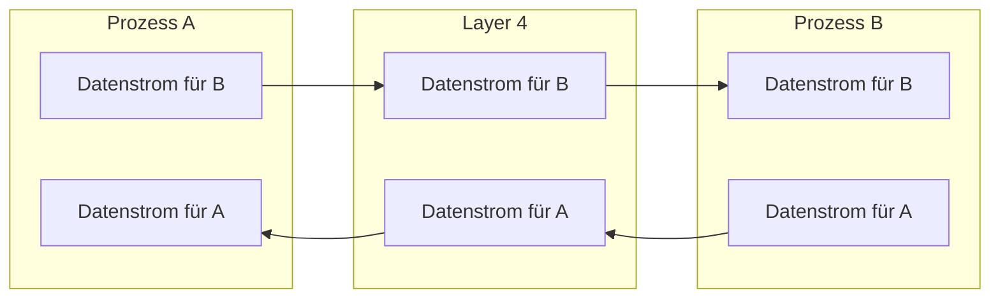
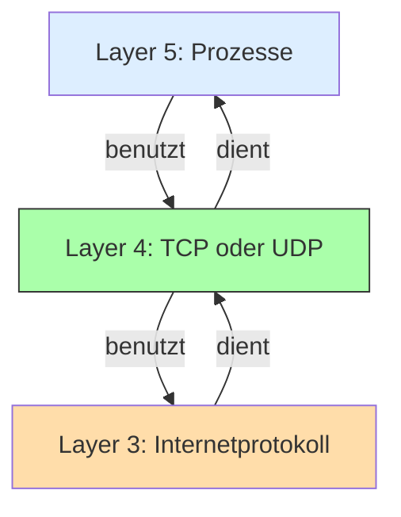

Layer 4 bietet **Interprozesskommunikation**. Prozesse sind **laufende Programme**. Layer 4 sorgt dafür, dass laufende Programme miteinander kommunizieren können, unabhängig davon ob sie auf dem selben Computer oder auf unterschiedlichen Computern laufen.

---

<Columns>
	<Column>

Layer 4 **benutzt** Protokolle auf **Layer 3**, insbesondere das Internetprotokoll (IP). Layer 4 **dient** wiederum Prozessen auf **Layer 5**.

Die Prozesse auf Layer 5 sind nichts anderes als Programme, die gerade laufen und vom Betriebssystem die nötigen Ressourcen (Speicher, Prozessor usw.) zugewiesen bekommen haben.
	</Column>
	<Column>

</Column>
</Columns>

Diese Programme können zum Beispiel Computerspiele oder Teile von Computerspielen sein. Typische Programme auf Layer 5 sind Webbrowser wie Chrome, Firefox oder Edge. Browser implementieren höhere Protokolle wie HTTP. Layer 4 dient also sowohl unterschiedlichen laufenden Programmen direkt als auch L5-Protokollen, wie HTTP oder FTP, die in Programmen implementiert sind.

Wenn wir selbst Programme schreiben, die miteinander kommunizieren sollen, können wir ein Layer-4-Protokoll benutzen, damit es sich um die Übertragung der Daten kümmert.

Da Layer 4 in der Regel das paketvermittelte und nicht-zuverlässige Internetprotokoll benutzt, gibt es keine Gewissheit darüber, ob Internetpakete jemals angekommen sind. Auch ob die Internetpakete in der richtigen Reihenfolge angekommen sind, ist ungewiss. Wenn die Programme auf Layer 5 sich nicht darum kümmern sollen müssen, ob Daten erfolgreich und in der richtigen Reihenfolge übertragen wurden, muss diese Aufgabe auf Layer 4 erledigt werden.

Die zuverlässige Datenübertragung über eine unzuverlässige Strecke wie das Internet kostet Speicher, Rechenaufwand, zusätzliche Kommunikation und damit auch Zeit. Layer 4 bietet Programmen, denen Geschwindigkeit wichtiger ist als Zuverlässigkeit, auch nicht-zuverlässige Interprozesskommunikation. Je nach Anwendungsfall ist Zuverlässigkeit nicht nötig oder das Programm auf Layer 5 kümmert sich selbst um die Zuverlässigkeit.

Layer 4 dient also laufenden Programmen, die mit anderen Programmen kommunizieren. Dabei nutzt Layer 4 in der Regel das nicht-zuverlässige Internetprotokoll auf Layer 3 und bietet vorallem eine zuverlässige aber langsame und eine nicht-zuverlässige aber schnelle Methode.
